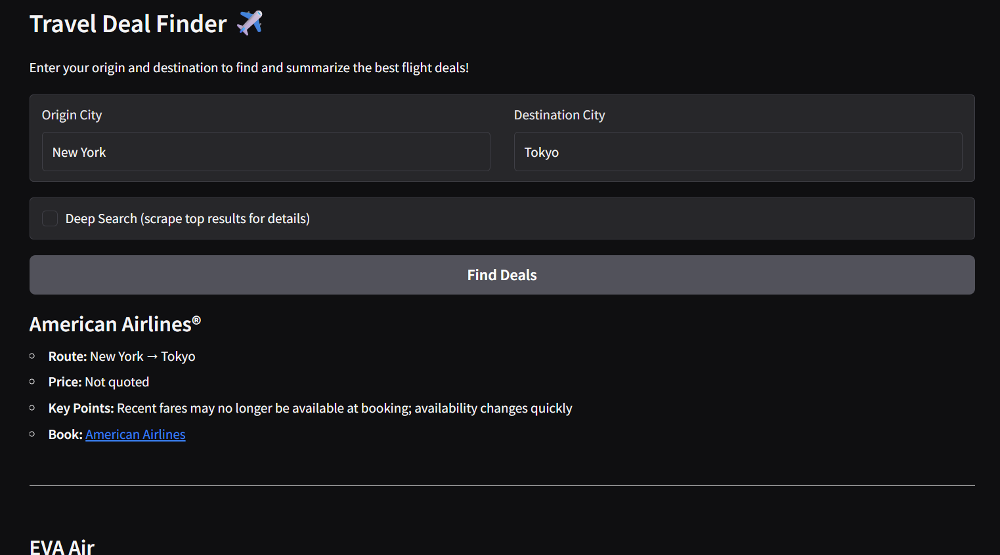

# ✈️ Travel Deal Finder with Kimi-K2

A web application to help you find and summarize the best flight deals between any two cities, powered by Firecrawl and Kimi-K2 APIs.

## Features

- **Flight Search:** Enter your origin and destination cities to search for the latest flight deals.
- **Summarized Results:** Get a clean, visually appealing markdown summary of the top flight options.
- **Deep Search Toggle:** Enable "Deep Search" to scrape and summarize detailed information from the top flight booking pages. Disable it for faster, search-only summaries.
- **Processing Time Display:** See exactly how long your search took to process.
- **Responsive UI:** The "Find Deals" button is disabled while results are being generated to prevent duplicate submissions.

## Demo Screenshot

 <!-- Add a screenshot if available -->

## Setup Instructions

1. **Clone the repository:**
   ```bash
   git clone https://github.com/kingabzpro/Travel-with-Kimi-K2
   cd Travel-with-Kimi-K2
   ```

2. **Install dependencies:**
   ```bash
   pip install -r requirements.txt
   ```

3. **Set up environment variables:**
   - You need valid API keys for both Firecrawl and Groq.
   - Set them in your environment:
     ```bash
     export FIRECRAWL_API_KEY=your_firecrawl_api_key
     export GROQ_API_KEY=your_groq_api_key
     ```
     On Windows (PowerShell):
     ```powershell
     $env:FIRECRAWL_API_KEY="your_firecrawl_api_key"
     $env:GROQ_API_KEY="your_groq_api_key"
     ```

4. **Run the app:**
   ```bash
   python app.py
   ```
   - The Gradio interface will open in your browser.

## Usage

1. **Enter your origin and destination cities** (e.g., "New York" and "Tokyo").
2. **Toggle "Deep Search"**:
   - **Enabled:** The app will scrape and summarize details from the top booking sites for richer information (slower).
   - **Disabled:** The app will only summarize the search results (faster).
3. **Click "Find Deals"**. The button will be disabled while processing, and you'll see a timer showing how long the search took.
4. **View Results:**
   - The left panel shows a markdown summary of the best flight options.
   - The right panel shows detailed info from the top booking site (if Deep Search is enabled).
   - The processing time is displayed below.

## Example Output

```
# ✈️ Flight Options: New York → Tokyo

---
## 1. American Airlines
- **Route:** New York → Tokyo (likely JFK/NYC → NRT/HND)
- **Price:** Not quoted (fare “may no longer be available”)
- **Key Points:** Economy and premium cabin deals collected within last 24h; subject to change at booking
- **Book:** [American Airlines](https://www.aa.com/en-us/flights-from-new-york-to-tokyo)

---
## 2. EVA Air
- **Route:** New York (JFK) → Tokyo (HND)
- **Price:** From USD 1,288 (round-trip)
- **Key Points:** Early-booking promo; best fares when planned in advance
- **Book:** [EVA Air](https://flights.evaair.com/en/flights-from-new-york-to-tokyo)

---
## 3. ANA (All Nippon Airways)
- **Route:** New York → Tokyo (NRT/HND)
- **Price:** Low-fare advertised, exact figure not shown in snippet
- **Key Points:** Complimentary meals, world-class entertainment, full-flat seats in premium cabins
- **Book:** [ANA](https://flights.ana.co.jp/en-us/flights-from-new-york-to-tokyo)
```

## Environment Variables
- `FIRECRAWL_API_KEY`: Your Firecrawl API key
- `GROQ_API_KEY`: Your Groq API key

## Notes
- Some flight booking sites may block scraping; in such cases, Deep Search will skip to the next available result.
- The app is for demonstration and educational purposes.

## License
See [LICENSE](LICENSE).